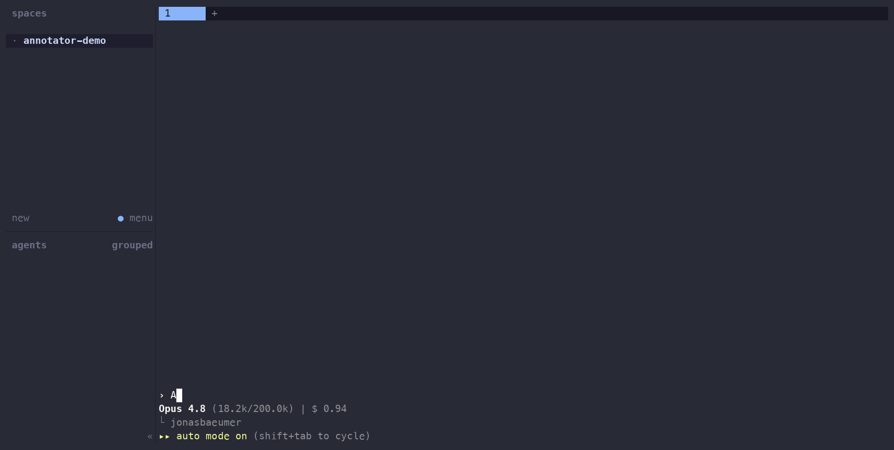

# herdr-file-annotator

**Maximize agentic development but dont lose touch with the actual codebase.**

Working with coding agents usually forces a choice: adopt an IDE-style tool
and leave your terminal workflow behind, or stay in the terminal and squint
at raw diffs and verbose agent prose in chat. This [herdr](https://herdr.dev)
plugin removes the choice, when you and your agent need to meet over actual
code, a review pane opens right in your workspace, and closes when you're
done.



**Annotate the code, not the prompt.** No more dictating "change file X, line
Z…" into the prompt. Select the lines in the pane, write the note, tag it
(`fix` / `verify` / `question` / `nit`) — it flows back to the agent as
structured, line-anchored output it acts on directly.

**Let the agent walk you through its changes.** In the era of 1000-line
diffs, reading everything doesn't scale, and agent prose summaries are a
poor substitute for the code itself. Here the agent drives the pane: it
jumps you to exactly the parts worth seeing while explaining in chat. Ask
questions, ask for the next spot — you only see what you need to see.

**Diff or finished state, just a toggle away.** Reviewing the changes is the default;
press `t` when you just want to read the final version of the file, no diff
noise.

**A real sign-off gate, if you need it.** In blocking mode the agent is
*frozen* until your verdict (approve, request changes, or cancel) so
nothing runs past your review.

Also in the box: full mouse support, syntax-highlighted diffs, a `?`
key-reference overlay, one-command install with checksum-verified binaries,
and an agent that can never be wedged by a closed pane or timeout.

## Quick start

Requires herdr ≥ 0.8.0.

```sh
# 1. Install the plugin
herdr plugin install JonasBaeumer/herdr-file-annotator

# 2. Register the MCP server with your agent (Claude Code shown) —
#    find <plugin_root> via: herdr plugin list --plugin jonasbaeumer.file-annotator --json
claude mcp add annotator -- "<plugin_root>/bin/herdr-annotator" mcp
```

Then tell the agent when to ask for review — e.g. in `CLAUDE.md`:

> Before marking any task complete, call the `review_changes` tool and act on
> the returned annotations. Do not proceed on a `request_changes` or `reject`
> verdict without addressing the feedback.

That's the whole setup. Everything below is reference.

---

## How it works

One Rust binary, two modes:

```
┌─ agent pane ─────────────┐   ┌─ review pane (this plugin) ─┐
│ Claude Code              │   │ colored, scrollable diff     │
│  └─ herdr-annotator mcp  │   │ a approve · r request        │
│     (MCP stdio server)   │   │ changes · q cancel           │
└──────────┬───────────────┘   └──────────────▲───────────────┘
           │  herdr plugin pane open --env ANNOT_SOCKET=…
           └──────────────────────────────────┘
              verdict + annotations flow back over the unix
              socket and become the blocked tool call's result
```

- `herdr-annotator mcp` — MCP stdio server registered with your agent. Its
  `review_changes` tool binds a unix socket, opens the review pane via the herdr
  CLI, and blocks until the pane answers. A dead or closed pane maps to a
  `cancelled` verdict, so the agent can never be wedged.
- `herdr-annotator pane` — the review TUI, declared as a herdr plugin pane
  entrypoint. Launched by herdr, never by hand.

The plugin installs under a herdr-managed directory (e.g.
`~/.config/herdr/plugins/github/herdr-file-annotator-<hash>`); installs
download a prebuilt binary for macOS (arm64/x86_64) or Linux (x86_64/arm64,
static musl), verify its SHA-256, and fall back to building from source with
cargo if no matching prebuilt exists.

## Controls

Press `?` in the pane for the full context-aware key reference.

| Where | Keys | Mouse |
|---|---|---|
| File list | `j`/`k` move · `g`/`G` ends · `l`/`Enter`/`Tab` → diff | wheel moves selection, click opens a file |
| Diff | `j`/`k` cursor · `←`/`→` (or `H`/`L`) pan wide lines, `0` resets · `d`/`u` half page · `n`/`p` hunks · `g`/`G` ends · `h`/`Tab` → files | wheel scrolls, horizontal wheel pans, click places the cursor, drag selects a range |
| Annotate | `v` select range · `c` comment (Ctrl-T cycles tag, `Enter` saves, `Esc` backs out) · `c` on an annotated line edits · `x` deletes | drag then `c` |
| Layout | `b` hide/show the file list · `z` zoom the pane full-screen · `t` diff/source view · `?` key help | — |
| Finish | `a` approve · `r` request changes + summary · `q` cancel | — |

Long lines clip with `‹`/`…` markers; pan to see the rest. Annotations ride
back to the agent on both `a` and `r` verdicts.

## MCP tools

Four tools, one shared review protocol. `review_changes` blocks the agent until
a verdict lands. `show_changes` + `goto` + `collect_review` don't: they let the
agent open the pane, narrate the diff in chat while pushing navigation, and
come back for the verdict whenever it's ready. Annotations work exactly the
same way in both modes, and the reviewer can also just finish the review in
the pane at any time, without waiting to be asked.

| Tool | Blocks? | Arguments | Returns |
|------|---------|-----------|---------|
| `review_changes` | Yes | `baseline?`, `note?`, `working_dir?` | Verdict + annotations (below), once the human decides. |
| `show_changes` | No | `baseline?`, `note?`, `working_dir?` | `{"opened": true, "working_dir": "..."}` immediately. |
| `goto` | No | `file` (repo-relative, new/post-change side), `line` (1-based), `view` (optional: `diff` or `source`) | Confirmation text; navigation is advisory. |
| `collect_review` | No, polls | `wait_seconds?` (0–120, default 0) | Verdict + annotations once landed, else `{"status": "pending", "open_for_secs": N}`. |

`baseline`, `note`, and `working_dir` mean the same thing for `review_changes`
and `show_changes`:

| Argument      | Type   | Meaning                                                            |
|---------------|--------|--------------------------------------------------------------------|
| `baseline`    | string | Git rev to diff against. Omit for all uncommitted changes vs HEAD. |
| `note`        | string | Message shown to the reviewer ("please check the retry logic").    |
| `working_dir` | string | Repo to review. Defaults to the server's working directory.        |

Only one review — blocking or guided — can be open at a time: `review_changes`
and `show_changes` each refuse to start a second one, and `goto` / `collect_review`
refuse to run without one already open.

Verdict result (JSON in the tool response from `review_changes`, or from a
`collect_review` call once a verdict has landed):

```json
{
  "version": 2,
  "verdict": "request_changes",
  "summary": "retry loop still swallows the error",
  "annotations": [
    { "file": "src/portal.rs", "lines": { "start": 112, "end": 118 },
      "side": "new", "tag": "fix", "comment": "handle the None case" }
  ]
}
```

`review_changes` blocks for as long as the config's `review_timeout` allows
(unset = forever). The non-blocking tools have no such timeout — nothing is
blocked, so there's nothing to time out; the review stays open until the
reviewer finishes in the pane (or closes it). `collect_review` only ends the
review when a verdict has actually landed — a `pending` result leaves the
pane open, and the agent simply collects again later.

## Guided walkthroughs

Use `show_changes` instead of `review_changes` when you want to talk the
reviewer through a diff rather than hand it over cold and wait:

1. **Open it, non-blocking.** `show_changes(working_dir=..., note="new retry
   logic")` opens the review pane and returns immediately — you keep talking
   in chat instead of freezing on a verdict.
2. **Navigate while you explain.** Call `goto(file="src/retry.rs", line=42)`
   as you describe each piece; the pane jumps to follow along. The reviewer
   annotates as usual — annotations work exactly as they do in blocking mode.
3. **Collect the verdict when you're ready.** `collect_review()` checks once;
   pass `wait_seconds` to poll for a bit instead of hand-rolling a retry loop.
   Nothing landed yet returns `{"status": "pending", ...}` — that's normal,
   just call it again later. The reviewer can also finish in the pane on
   their own schedule at any point; a pane closed without a decision surfaces
   here as a normal `cancelled` verdict, not an error.

## Configuration

Optional `config.toml` in the plugin's config dir (find it with `herdr plugin config-dir jonasbaeumer.file-annotator`):

| Key | Default | Meaning |
|-----|---------|---------|
| `placement` | `"split"` | `split` (beside the agent) or `tab` |
| `direction` | `"right"` | Split direction: `right` or `down` |
| `focus` | `true` | Move keyboard focus to the review pane when it opens |
| `accept_timeout_secs` | `20` | How long the agent waits for the pane to appear |
| `review_timeout_secs` | unset | If set, a review left open this long returns a `cancelled` verdict |

## Development

Requires a Rust toolchain and herdr ≥ 0.8.0.

```sh
git clone https://github.com/JonasBaeumer/herdr-file-annotator
cd herdr-file-annotator
./scripts/dev-link.sh          # builds, symlinks bin/, runs `herdr plugin link`
```

`herdr plugin link` skips the `[[build]]` step (`scripts/fetch-or-build.sh`), so
`dev-link.sh`'s own `cargo build` is what produces `bin/herdr-annotator` here.
See [CONTRIBUTING.md](CONTRIBUTING.md) for the fork-and-PR workflow.

## Related projects

This is the inverse of [herdr-reviewr](https://github.com/persiyanov/herdr-reviewr)
(human-initiated, agent keeps running); both can coexist. The interaction model
is inspired by [annot](https://github.com/denolehov/annot), rebuilt as a native
herdr citizen.

## Status

Released and feature-complete for the core loop: agent-summoned blocking
review, guided walkthroughs, two-pane syntax-highlighted diff viewer with
full mouse support, line-anchored annotations, a config file, and prebuilt,
checksum-verified binaries for macOS and Linux. Listed on the herdr
marketplace.

See the [releases](https://github.com/JonasBaeumer/herdr-file-annotator/releases)
for per-version changes; ongoing work happens in pull requests.

## License

MIT. No code from annot (AGPL-3.0) is used; it is a behavioral reference only.
