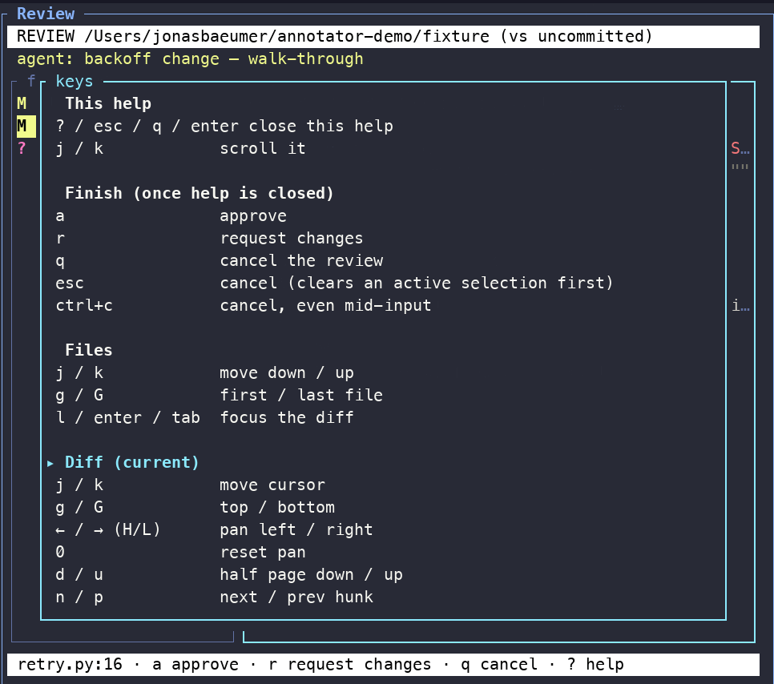
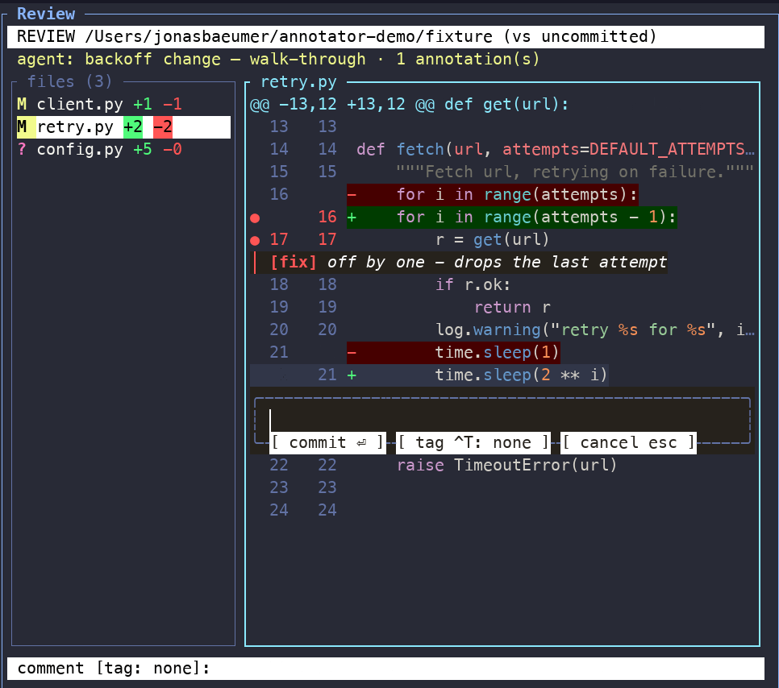
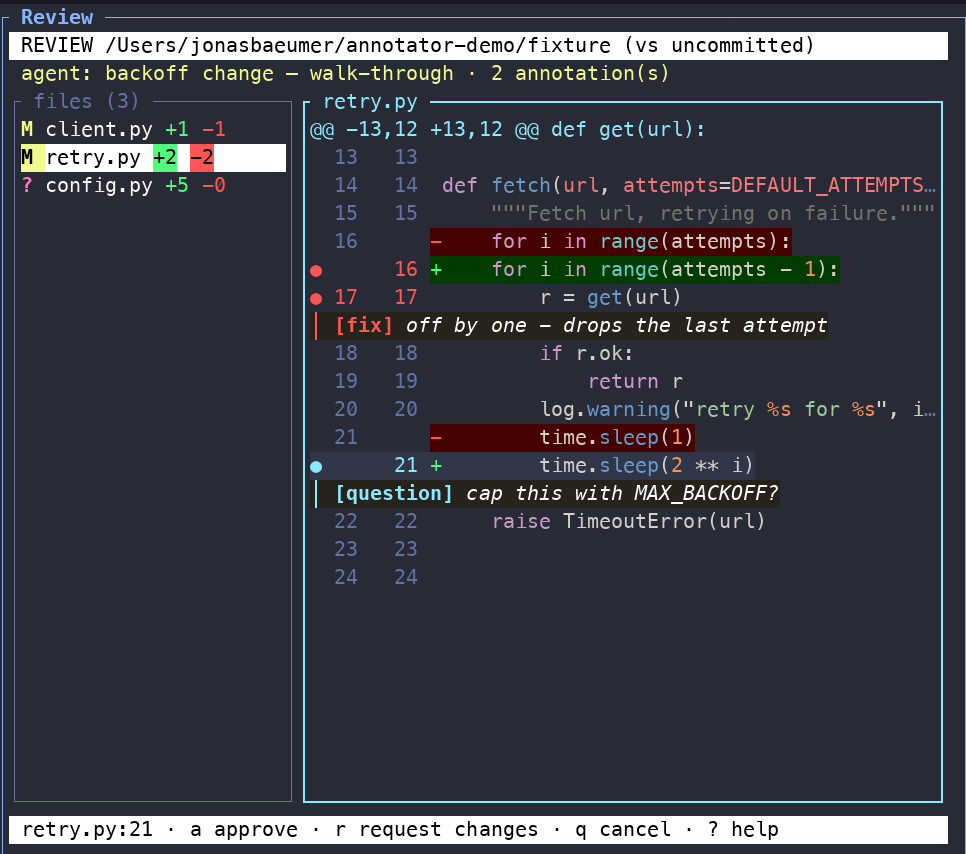
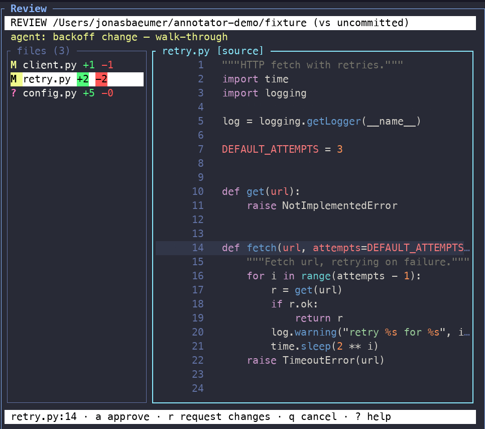
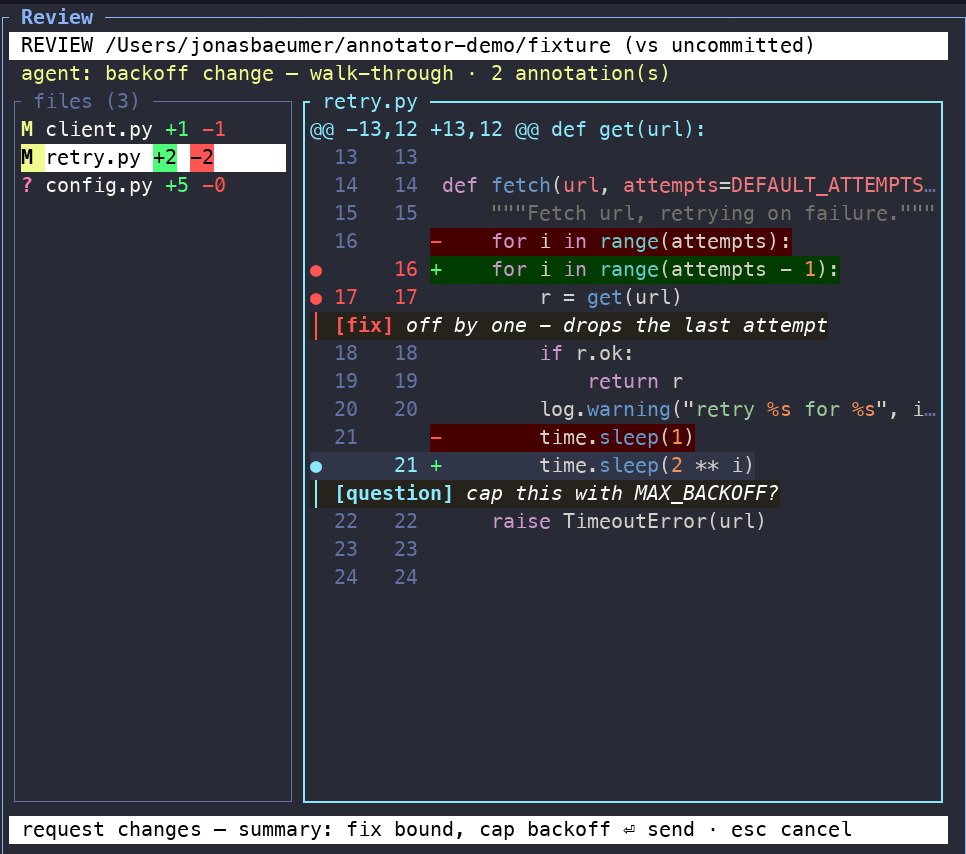

# Controls

Everything in the review pane is keyboard-driven, with full mouse support as
an alternative. Press `?` in the pane at any time for the context-aware key
reference — it shows exactly the keys that work in your current view.

## File list

| Keys | Action |
|---|---|
| `j` / `k` | move selection down / up |
| `g` / `G` | jump to first / last file |
| `l` / `Enter` / `Tab` | open the selected file in the diff view |

Mouse: wheel moves the selection, click opens a file.

## Diff view

| Keys | Action |
|---|---|
| `j` / `k` | move the cursor line |
| `←` / `→` (or `H` / `L`) | pan long lines horizontally, `0` resets |
| `d` / `u` | half page down / up |
| `n` / `p` | next / previous hunk |
| `g` / `G` | jump to top / bottom |
| `h` / `Tab` | back to the file list |

Mouse: wheel scrolls, horizontal wheel pans, click places the cursor, drag
selects a range.

Long lines clip with `‹` / `…` markers at the edges; pan to see the rest.

## Annotating

| Keys | Action |
|---|---|
| `v` | start a line-range selection (extend with `j` / `k`) |
| `c` | open the comment box for the selection (or the cursor line) |
| `Ctrl-T` | cycle the tag: none / `fix` / `verify` / `question` / `nit` |
| `Enter` | save the annotation |
| `Esc` | back out without saving |
| `c` on an annotated line | edit the existing annotation |
| `x` | delete the annotation under the cursor |

Mouse: drag over the lines, then press `c`.

Saved annotations appear inline, woven between the code lines, so you can
see your notes in place while you keep reading:

## Layout and views

| Keys | Action |
|---|---|
| `b` | hide / show the file list column |
| `z` | zoom the review pane full-screen (and back) |
| `t` | toggle diff view ↔ full source view of the file |
| `?` | key-reference overlay |

The `t` toggle is per file: reviewing the diff is the default, the source
view shows the finished state of the file with no diff noise. Annotations
work in both views.

## Finishing the review

| Keys | Action |
|---|---|
| `a` | approve |
| `r` | request changes — opens a summary box first |
| `q` | cancel the review |

Annotations ride back to the agent on both `a` and `r` verdicts. Closing the
pane without a verdict surfaces to the agent as a normal `cancelled` result,
never an error or a hang.

